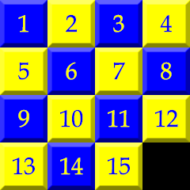

# PicoSystem 15 Puzzle

A version of the 15 Puzzle for the [Pimoroni Picosystem](https://shop.pimoroni.com/products/picosystem?variant=32369546985555), written in C++ using the Picosystem SDK.  Slide the tiles in the puzzle to re-arrange the numbers so they are in order from left to right and top to bottom. When the puzzle is solved, the RGB led on the Picosystem glows green. The puzzle tiles are arranged randomly, but only solvable tile arrangements are produced.

## Controls:-
- Move the tiles via the D-pad into the blank space.
- (A) Create a new random arrangement of tiles.

## Completed puzzle:-



## Required to build:-
- PicoSystem SDK - https://github.com/pimoroni/picosystem
- Pico SDK - https://github.com/raspberrypi/pico-sdk/

## Build:-
```
    mkdir build
    cd build
    cmake ..
    make
```
